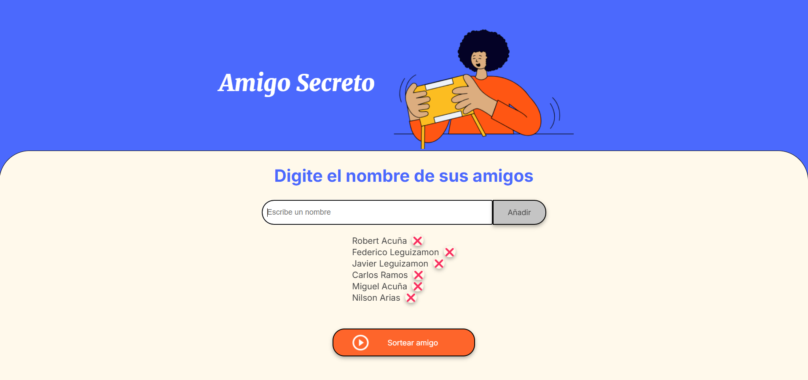
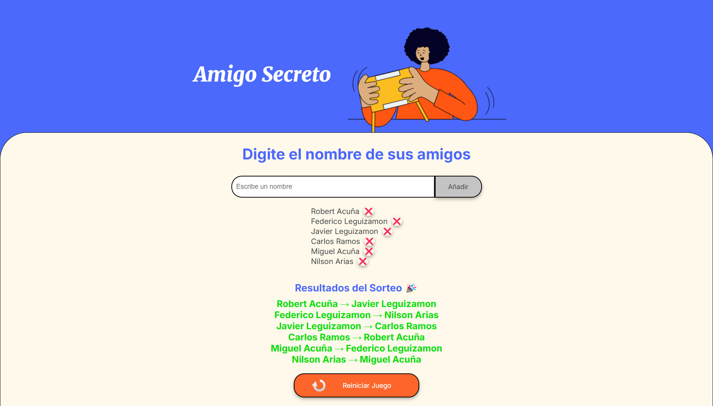

# 🎉 Proyecto Amigo Secreto

## 📌 Descripción

Este proyecto es una aplicación web interactiva para jugar al **Amigo Secreto**. Permite a los usuarios ingresar nombres, realizar un sorteo aleatorio y mostrar los resultados, asegurando que nadie se asigne a sí mismo. Además, cuenta con una opción para reiniciar el juego.

## 🚀 Funcionalidades

- **Agregar nombres** a la lista de participantes.
- **Validaciones:**
  - No se pueden ingresar nombres vacíos.
  - No se pueden repetir nombres.
- **Eliminar nombres** de la lista antes del sorteo.
- **Sortear amigos secretos aleatoriamente**, garantizando que nadie se asigne a sí mismo.
- **Bloqueo de nuevas adiciones** después del sorteo.
- **Cambio de botón de "Sortear Amigo" a "Reiniciar Juego"** una vez realizado el sorteo.
- **Mostrar resultados con un título destacado.**
- **Opción para reiniciar el juego y comenzar de nuevo.**

---

## 📂 Estructura del Proyecto

```
AmigoSecreto/
│── index.html   # Estructura HTML
|── README.md    # Documentacion
│── style.css    # Estilos CSS
│── app.js       # Lógica en JavaScript
│── assets/      # Imágenes e íconos
```

---

## 🖥️ Archivos y Código

### \*\*1️⃣ HTML (`index.html`)

Este archivo define la estructura principal del juego. Contiene:

- Un campo de entrada para los nombres.
- Un botón para agregar amigos.
- Una lista para mostrar los nombres ingresados.
- Un botón para iniciar el sorteo.
- Una sección para mostrar los resultados.

### \*\*2️⃣ CSS (`style.css`)

Define los estilos visuales del proyecto, incluyendo:

- Colores personalizados.
- Diseño responsivo.
- Botones estilizados.
- Mejora en la presentación de la lista y resultados.

### \*\*3️⃣ JavaScript (`app.js`)

Implementa la lógica del juego:

- **Manejo de eventos:** Se detecta `Enter` para agregar nombres.
- **Validaciones:** Evita nombres vacíos o duplicados.
- **Sorteo aleatorio:** Garantiza que nadie se asigne a sí mismo.
- **Actualización de interfaz:** Cambia el botón a "Reiniciar Juego" después del sorteo.
- **Reinicio del juego:** Borra la lista y permite agregar nuevos nombres.

---

## 🔧 Instalación y Uso

1. Descarga o clona el repositorio.
2. Abre `index.html` en un navegador.
3. Agrega nombres y presiona "Añadir" o `Enter`.
4. Presiona "Sortear Amigo" para generar los resultados.
5. Si deseas volver a empezar, presiona "Reiniciar Juego".

---

## 🖼️ Capturas de Pantalla

📌 **Interfaz antes del sorteo:**

> Input para agregar nombres y botón para sortear.

📌 **Interfaz después del sorteo:**

> Muestra los resultados con el título "Resultados del Sorteo 🎉" y opción de reinicio.

---

## 📜 Licencia

Este proyecto es de código abierto y puedes modificarlo libremente.